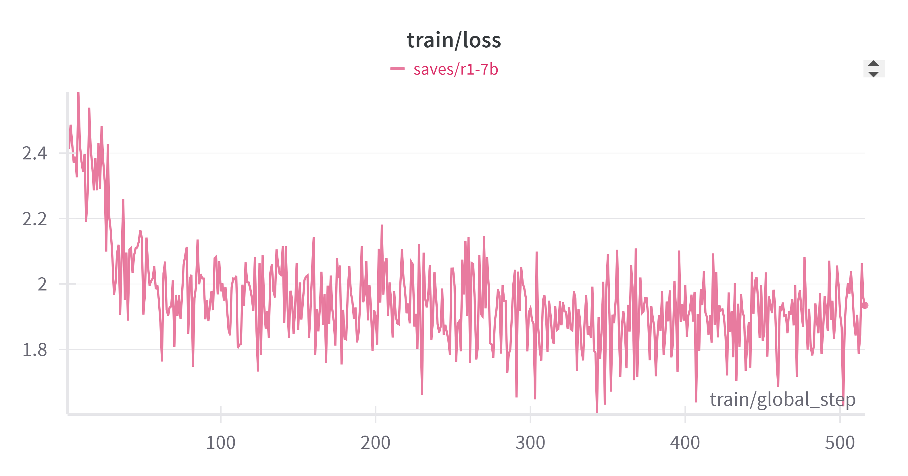
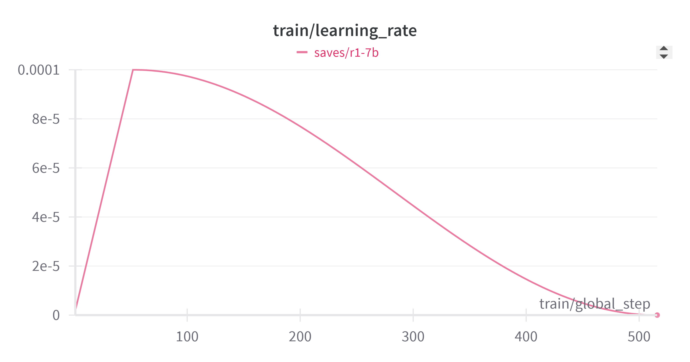
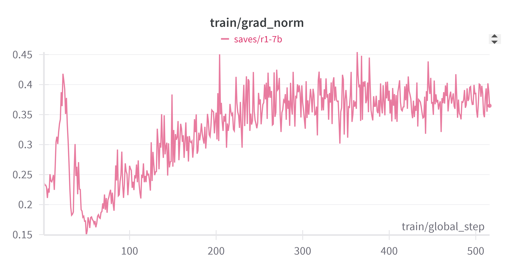
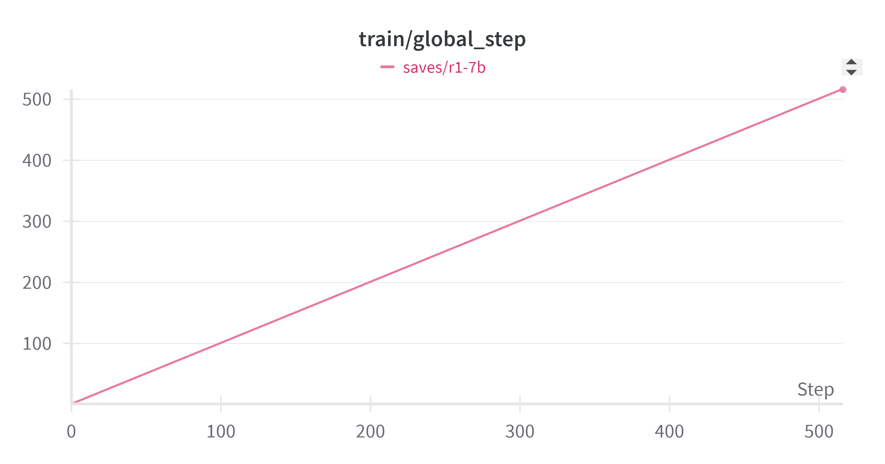
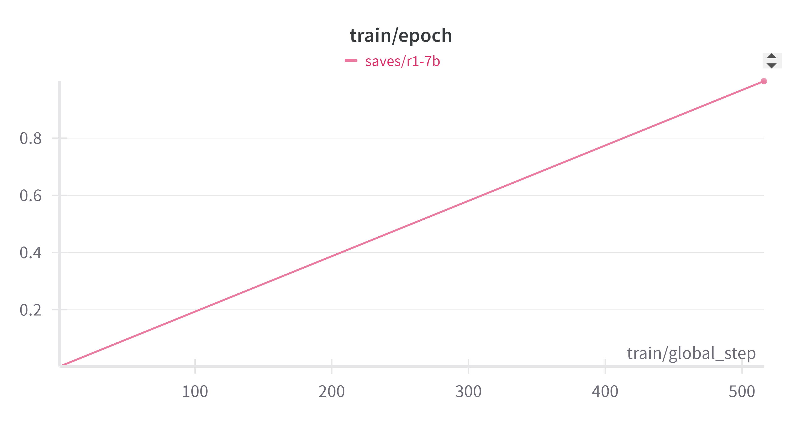

# README

# MedCoT-7B

一个轻量级的医学链式思维模型，通过蒸馏 Deepseek-R1 的知识优化，专注于复杂医学推理任务。

---

## 项目简介

MedCoT-7B 项目利用医学领域的链式思维（Chain-of-Thought, CoT）数据，对 Deepseek-R1-Distill-Qwen-7B 模型进行微调。项目采用 QLoRA（4-bit 量化 + LoRA 微调）以及 Unsloth 加速训练，大幅提升模型在医学复杂推理任务中的慢思考能力。知识蒸馏技术使得轻量级模型在保持高效、低资源消耗的同时，继承大模型的推理优势，构建一个高效、准确且具有良好解释性的医学问答系统。

---

## 主要特性

- **医学 CoT 数据蒸馏：** 利用高质量、多步推理的医学数据进行微调。
- **高效微调：** 结合 QLoRA（4-bit 量化与 LoRA 微调）和 Unsloth 加速训练，优化资源利用。
- **推理能力提升：** 显著降低困惑度（Perplexity），提升模型指令遵循率和答案准确性。
- **交互式界面：** 基于 Gradio 构建了实时、友好的交互前端。
- **中英文双语支持：** 同时支持中文和英文，适应多场景医学问答需求。

---

## 环境要求

- Python 3.8+
- PyTorch（请根据您的 CUDA 版本选择合适的版本）
- Transformers
- LLaMA-Factory
- Gradio
- 其他依赖请参见 `requirements.txt`

---

## 安装与配置

1. **克隆仓库**

   ```bash
   git clone https://github.com/Breeze648/MedCoT-7B.git
   cd MedCoT-7B
   ```

1. **创建并激活虚拟环境（推荐）**

   ```bash
   python -m venv venv
   source venv/bin/activate  # Linux/Mac
   venv\Scripts\activate     # Windows
   ```

2. **安装依赖**

   ```bash
   pip install -r requirements.txt
   ```

------

## 使用说明

### 数据预处理

- 准备医学 CoT 数据集（例如，经过清洗与去重的 `medical-o1-reasoning-SFT` 数据）。
- 运行数据预处理脚本 `data_preprocessing.py`，将数据转换为符合 CoT 模板的格式。

### 模型训练

- 配置训练参数，修改 `config.yaml` 文件中的相关配置。

- 运行训练脚本：

  ```bash
  python train.py --config config.yaml
  ```

  训练过程中采用 QLoRA 和 Unsloth 加速技术，在 RTX 4090-24G 显存设备上实现高效训练。

### 模型评测

- 训练完成后，运行 `evaluate.py` 对模型进行评估，查看困惑度、指令遵循率及答案准确性等指标。

- 如需体验交互式问答，可启动 Gradio 前端：

  ```bash
  python demo.py
  ```

------

## 项目目录结构

```
MedCoT-7B/
├── data_preprocessing.py   # 数据清洗与格式转换脚本
├── train.py                # 模型微调训练脚本
├── evaluate.py             # 模型评测与指标计算脚本
├── demo.py                 # 基于 Gradio 的交互前端
├── config.yaml             # 训练配置文件
├── requirements.txt        # 项目依赖列表
├── Tech Report			    # 实验报告
└── README.md               # 项目说明文档
```

------

## 贡献指南

欢迎大家对本项目进行贡献、提交问题和功能建议！
 请前往 [Issues](https://github.com//MedCoT-7B/issues) 提交问题，或通过 Pull Request 贡献代码。

------

## 许可证

本项目采用 MIT 许可证，详细信息请参见 [LICENSE](./LICENSE.md) 文件。

------

## 联系方式

如有任何问题或反馈，请通过 GitHub Issues 与我们联系，或发送邮件至 [yinfengzhechuanqi@gmail.com](mailto:yinfengzhechuanqi@gmail.com)。

------

## 附：实验记录

详细内容请参考 [实验报告](./Tech_Report.md) 。












