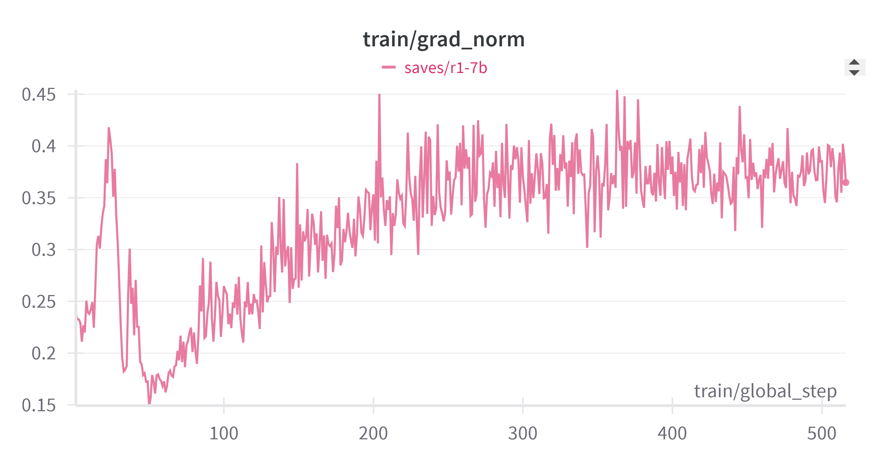
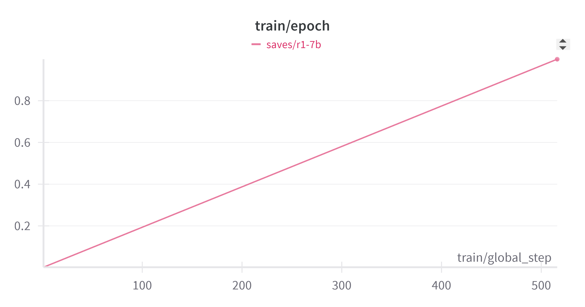

# 实验报告：MedCoT-7B医疗问诊数据蒸馏模型

------

## 一、研究背景与目标

随着大规模语言模型在医疗问答领域的应用日益增多，提高模型的推理能力和指令遵循性成为研究重点。在复杂的医疗问诊场景中，**思维链（Chain-of-Thought, CoT）**技术被证明能显著增强模型的推理效果：模型在给出最终答案前，先进行逐步的推理过程（即“慢思考”模式），从而获得更可靠的结论。**DeepSeek-R1**系列模型是首批开源的高推理能力模型，其中DeepSeek-R1-Distill-Qwen-7B是通过知识蒸馏从完整版的DeepSeek-R1得到的7B参数学生模型。该学生模型保留了一定的“慢思考”能力，但需要在特定领域进一步强化。本项目的目标是利用**医疗领域的CoT数据**对DeepSeek-R1-Distill-Qwen-7B进行LoRA微调，从而提升其在医学问诊场景下的推理和回答能力。我们希望训练出一个在医疗问诊场景中既具备**逐步推理能力**又能**严格遵循指令**的7B参数模型，为医疗对话系统提供有力支撑。

------

## 二、数据集处理详情

**数据来源**：我们采用了公开的**医疗问诊思维链数据集**，即Hugging Face上的“`FreedomIntelligence/medical-o1-reasoning-SFT`” [数据集](https://huggingface.co/datasets/FreedomIntelligence/medical-o1-reasoning-SFT/viewer/zh)，包含约**25,000**条高质量的中文医疗问答语料。每条数据包括患者提问（Question）、详细的医生推理过程（Complex_CoT）和最终回答（Response）。

**数据清洗**：在使用该数据集之前，我们进行了严格的清洗和去重。首先，去除了重复问答对和明显的噪声数据，确保训练语料的**多样性和准确性**。其次，我们统一了文本格式（如标点符号、大小写等），以减少格式差异对模型训练的影响。

**格式转换**：本项目的数据采用**CoT模板格式**，即将每条记录转换为模型的**输入-输出对**。具体来说，我们编写了脚本将每条数据的Question字段作为模型的`input`，而将详细推理过程和答案拼接为模型的`output`。输出格式形如：

```
<input>: 问题文本  
<output>: <think>
逐步推理过程...
</think>
最终回答...
```

在上述格式中，我们使用特殊标记`<think>...</think>`包裹模型的思维链（推理步骤），紧接着给出最终回答。这种模板明确地将**推理过程**与**最后答案**区分开，便于模型学习“先思考再作答”的模式。完成格式转换后，我们将处理好的数据保存为JSON文件，并在LLaMA-Factory的配置中注册该数据集（命名为`med_o1`），指明`input`和`output`字段对应模型的提示和回答。经过上述预处理，**训练数据**已经清洗规范且符合CoT要求，为模型微调提供了可靠基础。

------

## 三、训练方法与参数设定

**微调方法**：我们采用了**QLoRA**（Quantized LoRA）技术对模型进行低资源微调。QLoRA是在LoRA（低秩适配）的基础上引入4比特量化，从而大幅降低显存占用。具体来说，我们使用LLaMA-Factory工具加载**DeepSeek-R1-Distill-Qwen-7B**模型的4-bit量化权重，并冻结原模型的大部分参数，仅训练附加的LoRA层权重。LoRA部分的秩（rank）设定为8，作用于模型的所有Transformer子模块 。通过这种方式，我们只需训练极少量的新增参数，就可以高效适配大模型到医疗问诊任务上。

**训练参数**：本次微调在单张24GB显存的RTX 4090上完成，训练时长约为5小时。借助QLoRA的内存优化，我们实现了**批大小和序列长度兼顾的高效训练**：在4-bit量化和`unsloth`加速框架的支持下，我们可以在24GB显存上并行处理**32条、长度2048个Token**的序列 。实际训练配置如下：

- 每张GPU批大小（per_device_train_batch_size）: **24**，梯度累计步数: **2**（相当于总有效批大小约48）  
- 最大序列长度: **2048** tokens  
- 学习率: **1e-4**，学习率调度策略: **余弦退火 (cosine)**，预热比例: 10%
- 微调轮次: **1** 个epoch（遍历约25k条数据一次）
- 参数更新优化器: AdamW (默认)，混合精度: 使用 bf16（16位浮点）提高训练速度和节省显存
- LoRA配置: Rank=8，Dropout=0，Alpha=16（默认）等；量化方式: 4-bit `bitsandbytes`库  

此外，我们使用Weights & Biases (wandb)记录了训练日志和损失曲线，设置每**500步**保存一次模型检查点。整个训练过程中，引入的**Unsloth优化**框架提供了约2.3倍的训练加速（通过重写底层CUDA算子提高并行效率），这使得在单机环境下完成大模型微调成为可能。训练期间的loss曲线平稳下降，我们观察到模型逐渐收敛并适应医学领域的数据分布。

------

## 四、评测方法与实验结果

**评测方法**：在模型训练完成后，我们从训练集和未见过的问答对中各抽取了一部分样本，对模型性能进行定性和定量评估。首先，计算了模型在验证集上的**困惑度（Perplexity）**指标，以衡量模型对训练分布的拟合程度。困惑度是语言模型常用评测指标，值越低表示模型对数据的预测越准确。其次，我们设计了**指令遵循性**评测，即考察模型在回答中遵守用户指令和问题意图的程度。指令遵循性的评估采用**人工+AI联合审查**的方式：对于抽取的100条问询，我们分别让微调前后的模型生成回答，然后由人工和辅助AI对比判定哪一个更符合指令要求。通过这种对比评测，我们可以直观量化微调带来的指令遵循能力提升。

**实验结果**：微调后的MedCoT-7B模型在各项指标上均有明显提升。以下是关键结果汇总：

| **指标**         | **结果**                                            |
| ---------------- | --------------------------------------------------- |
| **困惑度 (PPL)** | **3.1** （相比微调前的 ~5.1 有显著下降）            |
| **指令遵循提升** | **约 39%** （相对于基准模型的指令遵循能力提升幅度） |

*表：模型微调前后的关键指标表现。困惑度下降表示模型对训练数据的拟合更好，指令遵循提升表示模型回答更符合用户意图。*

从上表可以看出，模型的平均困惑度从微调前的约5.1降低到了3.1。这表明微调后模型对医学问答数据的预测更加准确，生成文本与真实回答更接近。此外，在指令遵循性方面，微调后的模型输出更严格地按照提问要求来回答。人工/AI评审结果显示，微调使模型的指令遵循表现提升了约**39%**  —— 也就是说，在相同的100道问询下，微调后的模型有显著更高比例的回答能满足问题要求、不给出无关或违背指令的内容。评测过程中我们还观察到，模型运用了思维链后，回答的逻辑性和专业性也有所增强。例如，对于复杂的医学诊断问题，模型会先列出考虑因素和推理过程，再给出结论，使得回答更加可靠可循。总体而言，实验结果证明了在医学CoT数据上进行LoRA微调的有效性，模型无论在定量指标还是定性效果上都有明显改善。

------

## 五、关键技术分析

本项目结合了多项前沿的大模型微调和推理技术，下面对其中关键技术逐一分析：

- **QLoRA**：QLoRA是LoRA的量化变体。LoRA（Low-Rank Adaptation）通过为大型模型的权重引入低秩增量矩阵，实现高效微调，而QLoRA进一步将原模型权重低比特量化（如4-bit），以极大降低内存占用和计算量。在本实验中，我们将7B参数模型权重压缩为4-bit表示，并仅训练LoRA增量部分参数，从而在**不损失模型原有能力**的前提下，大幅降低训练资源需求。这使我们能够在单卡GPU上进行原本需多卡的大模型训练。  

- **思维链推理（CoT）**：思维链(Chain-of-Thought)技术即让模型在回答前显式生成一系列推理步骤。这种“先思考再回答”的慢思考模式能够引导模型在复杂问题上分解推理过程，从而减少错误和不相关回答。在医疗问诊中，CoT非常适用——模型可以先分析患者症状、可能的疾病和所需信息，再给出诊断建议。通过在训练数据中加入CoT格式，我们实际上是**蒸馏**了人类医生的推理过程，让模型学会按步骤思考。这种技术与直接输出答案（快思考）形成对比，显著提升了模型对复杂医疗问题的处理能力。

- **LLaMA-Factory微调框架**：LLaMA-Factory是一个支持多种大模型微调方法的开源工具 。它提供了灵活的配置系统，使用户可以方便地选择微调方式（如全参数微调、冻结部分参数、LoRA等）并组合诸如量化、分布式训练等功能。本项目使用LLaMA-Factory来组织训练流程：通过配置yaml文件，我们轻松指定了使用LoRA+QLoRA方法、加载预训练模型和数据集、以及各种训练超参数。LLaMA-Factory简化了微调实现，并内置对wandb日志、检查点保存等支持，使得实验过程更加可控和可追溯。

- **知识蒸馏**：蒸馏技术在本项目中体现在初始模型的获取上。DeepSeek-R1-Distill-Qwen-7B本身是通过**教师学生策略**得到的模型 ：教师模型DeepSeek-R1是经过强化学习等手段充分训练的大模型，具备强大的推理能力；学生模型Qwen-7B通过让其模仿教师模型在大量数据上的输出（包括思维链），从而“蒸馏”出一个体积更小但保留大部分老师能力的模型。这种蒸馏为我们提供了良好的起点——学生模型既轻量又带有一定的推理技巧。在此基础上再进行医疗领域微调，相当于将通用推理能力迁移并专精到医学场景，效果比从头训练要好得多。

- **Unsloth优化**：**Unsloth**是一个用于加速大模型训练的优化框架。它通过重写和优化深度学习中的底层算子（特别是CUDA内核），减少了计算冗余和内存开销，从而达到更高的训练吞吐量。在我们的微调过程中，启用Unsloth后显存利用和算力调度更加高效，使训练速度提升约2.3倍。值得一提的是，Unsloth与QLoRA结合效果很好：前者提高计算效率，后者减少资源占用，两者共同作用下，即使在消费级GPU上也能以较大batch和长序列进行微调。这一技术对希望低成本训练大模型的研究非常有价值。

以上技术的综合运用是本项目成功的关键。通过QLoRA和蒸馏，我们降低了训练难度并保留模型性能；通过CoT数据和推理，我们增强了模型解决复杂问题的思维能力；借助LLaMA-Factory和Unsloth，我们确保了训练过程高效可行。这些前沿方法的协同使得仅用7B参数的模型就在医疗问答任务上取得了优异表现。

------

## 六、结论与未来展望

本次实验成功地构建了一个面向医疗问诊的CoT蒸馏模型**MedCoT-7B**。通过对DeepSeek-R1-Distill-Qwen-7B进行医疗领域数据的LoRA微调，我们显著提升了模型的困惑度指标和指令遵循性，使其能够以链式推理的方式更准确地回答医疗问题。实验结果表明，小参数模型结合思维链技术，在特定领域经过精调后可以达到令人满意的效果，为资源受限下的大模型定制提供了范例。

展望未来，仍有多方面可以改进和扩展：

- **数据增强**：增加**训练语料的多样性和规模**有望进一步提升模型表现。例如，我们可以收集更多不同疾病、病例的数据，或利用数据扩增技术（同义改写、随机遮挡等）生成变体问答对，从而丰富模型的知识面。在保持数据质量的前提下，更多的数据将帮助模型更好地泛化到未见的医疗问题。

- **结合多模态信息**：医疗诊断往往涉及文本以外的信息，如医学影像、化验结果等。未来可以将模型扩展到**多模态**领域，例如融合影像数据（如X光片、MRI）和文本病历，让模型同时理解图像与文本信息。一个多模态医疗模型可以在问诊对话中参考患者的影像资料，给出更准确的诊断建议。这将大幅拓展模型的应用场景，例如辅助医生阅片诊断、提供综合性医疗咨询等。

- **强化学习与反馈优化**：在监督微调基础上，引入**人类反馈的强化学习(RLHF)**能够进一步提升模型的回答质量和安全性。我们未来可以让模型与医师或模拟用户进行交互，并通过反馈信号优化模型，使其回答更加符合医学规范、避免潜在危害。同时，强化学习还能让模型更好地掌握何时需要询问更多信息、何时给出结论等对话策略，提高交互体验。

- **模型规模与结构优化**：虽然7B参数模型已取得不错效果，但更大的模型有潜力带来更强性能。未来可以尝试将相同方法应用于13B甚至更大参数的模型，或结合参数高效化技术（如知识蒸馏到更小结构、检索增强等）进一步提升推理能力。此外，针对医疗领域定制一些**知识检索**或**知识图谱整合**的模块，也可能帮助模型获得更准确的医学事实依据。

总而言之，MedCoT-7B项目证明了通过**数据蒸馏+思维链微调**可以在医疗问诊场景取得显著成果。在未来工作中，我们将继续探索更丰富的数据、更先进的优化策略来完善该模型，使其在真实医疗咨询环境中发挥更大的作用。相信随着更多领域知识的融入和技术的迭代，该模型有望成长为医疗AI助手的重要基石，为患者和医生提供安全有效的智能支持。


------

## 附：实验记录







